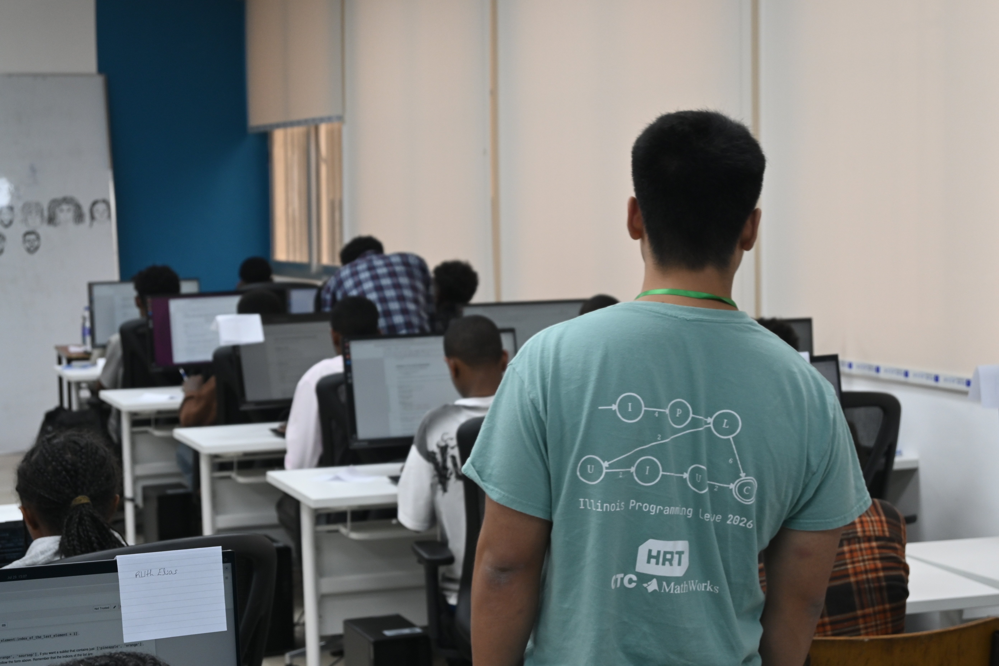
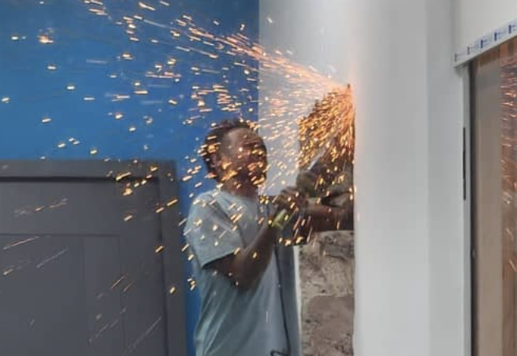
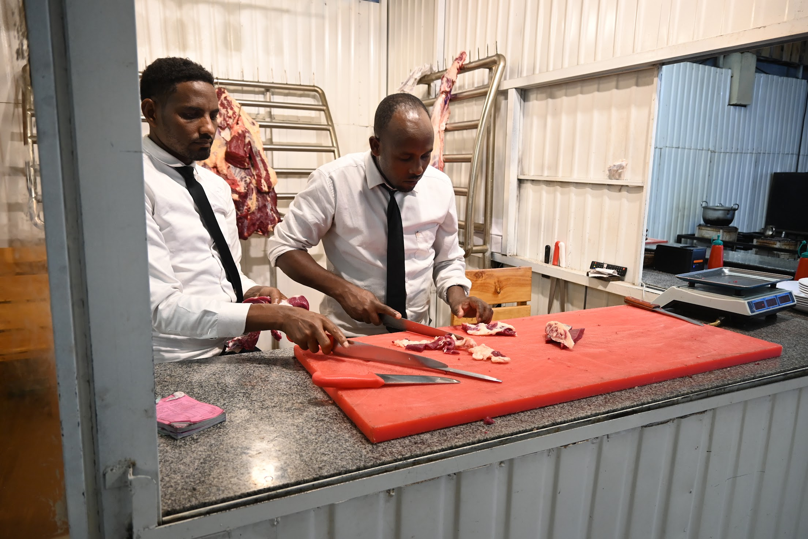
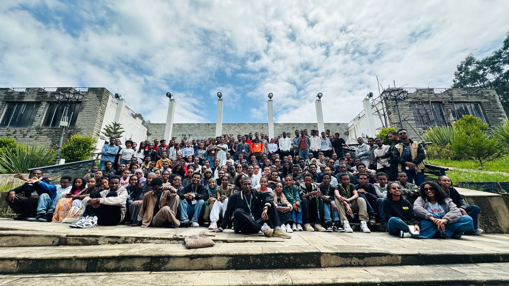
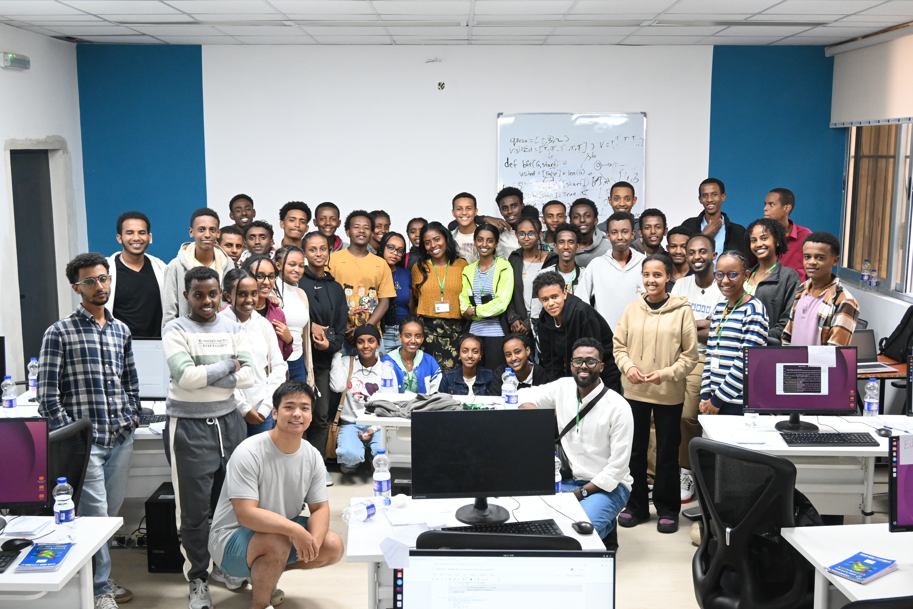

Most summers as a CS student, I'd spend doing the predictable thing. Rotting away in an office in Sweden where 80% of the staff are on vacation, coding on some internal tool. Instead, this summer after graduation I spent 5 weeks in Addis Ababa teaching algorithms to some of the sharpest high schoolers in Ethiopia.

The premise of AddisCoder is straightforward but ambitious: bring 150 top students from across Ethiopia to the capital for an intensive, free summer bootcamp.

To support them, the program has a dedicated group of chaperones and a crew of 36 teaching assistants, split roughly down the middle between local Ethiopian university students and international TAs from around the world. Each week featured a different visiting guest lecturer (mostly university professors), with the exception of week three, when one of our own TAs stepped up to teach (shoutout to Jennifer!).

While the syllabus starts with the absolute basics, it does not stay there for long. The pace is fast, very fast:

- Week 1: Variables, loops, conditionals, and core Python syntax.
- Week 2: Recursion, sorting, and binary search.
- Week 3: Fundamental graph theory and tree traversals.
- Week 4: Advanced algorithms like Bellman-Ford, Dijkstra, and dynamic programming.

Ethiopia has a population of roughly 140 million people, heavily skewed toward the youth. These 150 kids were complete academic weapons. Many walked in with virtually no prior coding experience, yet within a month, they were casually reasoning through advanced concepts faster than I thought was possible.

The engagement from the students made it very fun to teach. Students were hungry to learn, always asking really good questions which weren't always easy to answer.

### **Being a TA**

As professors are rotating more or less every week, the only constant throughout the program was us TAs. This meant that we were collectively deciding on the materials for the labs and working on it. We'd prepare worksheets, lab materials and quizzes, often staying up in the evening to complete them.

As a TA, my daily routine was roughly something like:

1. Having an Ethiopian based breakfast in the lobby with other fellow TAs and professors.
2. Going on the early shuttle or later early shuttle (guess which one I picked) and arriving at the uni before 9:00.
3. While the students and professors went for lecture for an hour, we TAs would prepare the labs with usb materials (there was no reliable internet connection at the university) and do other admin.
4. Lab with students from 10:00, often we would start with a mini lecture on a specific problem or lectured topic. Then going around and helping students as they were doing exercises and worksheets.
5. Lunch! There was typical canteen style Ethiopian food served in the cafeteria. Sometimes, shamefully, we TAs would head to a local restaurant to have a meal with more familiar western food which we knew our stomachs would handle.
6. Another lecture and lab until 17:00. During the afternoon lecture, we TAs had some free time: playing cards, drinking coffee, or playing volleyball.
7. Head back on the shuttles, discussing how we could improve the material, how things are going and such.
8. Dinner and free time. Often we would group up and head to a nice restaurant around the Bole area where we lived.
9. In the evening, depending on will, need and availability, prepare the exercises, worksheets, quizzes and other materials for the coming days.

<figure>
  
  <figcaption>TA strolling through the lab</figcaption>
</figure>

While the everyday schedule was somewhat consistent, daily life in Addis was not. Highlights include:

- Two men walking a pink goat on the street by holding its hands.
- Ernest getting his phone pickpocketed while we're out walking. Then chasing down and confronting the pickpocket. Ensuing police drama including an arrest, light beating and followup for "interrogation". Certain cultural differences in how police operate compared to western countries were made apparent here.
- Workers deciding to replace the doors of the lab rooms during lab time.

<figure>
  
  <figcaption>Sparks flying mid-lab as workers replaced the doors</figcaption>
</figure>
- Students surprising us with a traditional coffee and cake ceremony inside the lab!
- Having raw meat (Tere Siga and Kitfo) for lunch.

<figure>
  
  <figcaption>Tere Siga being prepared</figcaption>
</figure>
- Very large hail storms, ensuing snowball fights after.
- Visiting the world's largest open-air market Mercato. Complete chaos.

### **Life in Addis**
Weekends were off, and we used the time to recharge and explore Addis Ababa. One weekend we went up to Entoto Park with the students to hike, do archery, try some sketchy rock climbing, and take a ridiculous amount of photos.

<figure>
  
  <figcaption>Students, chaperones and TAs at Entoto Park</figcaption>
</figure>

Food was one of the things I was most looking forward to before coming to Ethiopia, and it did not disappoint. In a city like Addis, you get both incredible local spots and surprisingly good foreign food.

Local Ethiopian food is very spicy. Even after having lived four months in Korea, I was no match. Some dishes include: Doro Wat (slow-cooked spicy chicken) and Shiro (a chickpea-based stew, hummus-adjacent, absolute 10/10). Pretty much everything is served on Injera, the spongy sourdough flatbread. I like it, some don't. You will get tired of it after having it every day.

We also tried Tere Siga (raw beef) for lunch one day, walked away just fine.

Beyond Ethiopian food, Addis has a massive variety of options. The biggest surprise was the Chinese food: there are both local adaptations and completely authentic spots where you can find proper hand-pulled Lanzhou beef noodles.

Another regular favorite was a Yemeni restaurant we kept going back to, and an Indian restaurant called Chile's.

Then there is the coffee. Since coffee originates in Ethiopia, it is a huge part of daily life. It tastes like coffee back home, just a lot better and way stronger. Getting coffee is often an entire sit-down ritual: small ceramic cups, tiny wooden stools, and smoking incense on charcoal burners. We'd often have it in the cafeteria after lunch in such a setting.

<!-- Weekends are off, and we'd use the time to recharge and explore Addis Ababa. One weekend we went to Entoto park with the students. We hiked, did archery, some sketchy rock climbing and took lots and lots of pictures!

<figure>
  
  <figcaption>Students, Chaperones and TAs at Entoto park</figcaption>
</figure> -->

<!-- While we were there to teach the students, I also think we learned quite a bit ourseleves. One quickly realises that teaching is not necessarily trivial, and students often have really good, tricky questions. Being a TA here I think I became much better at articulating myself and teaching different computer science topics. Also preparing all the exercises, worksheets and quizzes required a lot of work and peer review. While I had been a teaching assistant before back at uni in Sweden, here I was much more engaged. As professors are rotated every week, us TAs are the only constant, and it was pretty much us making the decisions and planning for the program. -->

<!-- ### **Food and Coffee**

The food was one of the things I was most looking forward to before coming to Ethiopia. It was no disappointment, in a city like Addis Ababa you can have not just amazing ethiopian food but also great foreign food.

Ethiopian food itself is very spicy, even after having spent 4 months in Korea I was no match. Often it comes in the form of various such as Doro Wat (slow cooked chicken) or Shiro (chickpea based, hummus like, 10/10). Practically all ethiopian food is paired with Injera, a spongy sourdough like flatbread. It did get old after a while.

Beyond the local cuisine, Addis Ababa as a modern metropolis offers a huge variety of food. One thing I was pleasantly surprised by was the Chinese food. There are both Ethiopian-style adaptations and more authentic spots. You can even find hand-pulled Lanzhou Beef Noodles:

- picture LZN Noodles

One of my absolute favorites was a Yemeni restaurant, and the Indian spots were also very good.

In addition to the food, the coffee is also an amazing part of the ethiopian culture. Coffee originates from ethiopia, so you can imagine it's a big part of every day life. It taste just like the coffee back home, except a lot better and much stronger. It is often served in a traditional like setting, with specific cups, small chairs and smoking charcoal. -->

### **The ups and downs**

While the experience as a whole was amazing, it wasn't always easy. Ethiopia is a fascinating country, but it has real infrastructure hurdles. A few of the realities over the five weeks:

- Digestion roulette.
- Having to keep safety in mind. Although do note Addis in general felt safe. But you should be wary of your belongings and not walk alone at night.
- No truly consistent internet connection at the hotel or through sim card.
- General exhaustion. Between the teaching schedule and Addis itself, the pace is intense.
- Paying a shared 100 USD bill for a dinner while the largest cash denomination in ethiopia is 1.5 USD.

I also learned a lot more than I expected. Teaching when students are actively trying to poke holes in your explanations forces you to actually understand what you're talking about. Back home in Sweden, being a TA meant following a fixed manual. Here, because the professors swapped out every week while we stayed, we were the ones actually steering the labs, writing problem sets, and deciding what worked.

Seeing kids who had barely touched a computer a month earlier write dynamic programming solutions was unreal. Doing that alongside a fantastic crew in Addis beats rotting at a corporate desk.
<figure>
  
  <figcaption>Lab 1 (out of 6) group picture</figcaption>
</figure>

Highly recommend applying if you're interested:
[addiscoder.com](https://www.addiscoder.com)

